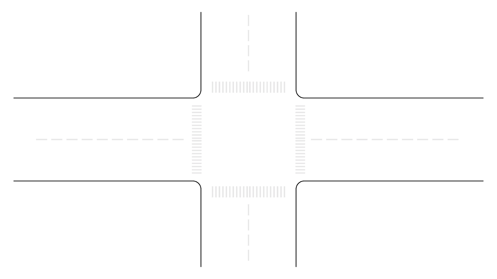
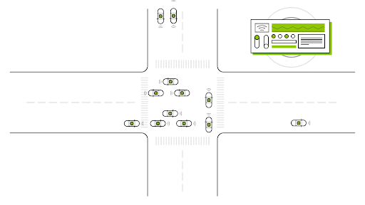

# ægir high level design

Updated February 2023.

## Objective

The aegir simulator models a bittide hardware distributed system, and what software running on a bittide cluster would look like. It exists to help understand how a bittide system would function, and what limitations and advantages it has.

## Background

The aegir simulator explores the benefits of logical synchrony in a bittide distributed system. Each node (i.e. machine) in a bittide distributed system has an oscillating clock, a processing entity (e.g. CPU), and a network link to each of its neighbor nodes. Every clock tick, each node receives one frame of data from every neighbor, sends one frame of data to every neighbor, and does a fixed amount of compute. Each node monitors its rate of incoming and outgoing frames; if a node is sending to its neighbors faster than it is receiving from its neighbors, it must be ticking faster than its neighbors, so it adjusts its clock to tick slower. If it's sending slower than it's receiving, it's ticking slower than its neighbors, so it adjusts its clock to tick faster. In this fashion, the entire cluster of nodes will end up equalizing their clocks, ticking in lockstep, in what we call logical synchrony.

Software running on a bittide system can take advantage of this logical synchrony. Because all nodes in a bittide system tick at the same rate, when code running on one node sends a message to another node, it can know exactly when that message will arrive, and when responses will come back. Because the rate of computation is predictable, and all communication can be prescheduled, software running on one node of a bittide cluster can make assumptions about the progress of code running on other nodes distributed around the cluster. This allows the entire system to be statically scheduled ahead of time, resulting in no congestion on the network, and predictable computation. This also enables fine grained quality of service guarantees; since everything is statically scheduled, it's possible to exactly control how much compute and communication each participant in the system is using.

If you make an analogy to traffic systems, traditional systems have synchronization points, where participants in the system have to wait their turn.

Whereas because of logical sychrony, every aspect of software running on a bittide system can be scheduled ahead of time. This means the programmer can depend on predictable message delivery, there is no need to add explicit synchronization; everything can be scheduled optimally.

## What is aegir?

aegir is a set of libraries for simulating applications running on simulated bittide hardware, written in Rust. aegir's purpose is to provide an environment where we can experiment with bittide, and validate the bittide model.

Typical usage is to write a command line program which uses the aegir libraries to define a topology bittide nodes you want to simulate, define what functions run on every one of those nodes, and define what messages are passed between those nodes. The result is a Rust command line program which simulates the application running on bittide hardware. See the `app/` directory for some examples of this.

While we are simulating a distributed bittide system, the entire simulation is modelled inside a single process, by modelling bittide hardware components in memory of that process.

## Components simulated by aegir

aegir simulates the nodes in a bittide cluster, their clocks, the links between the nodes, the messages travelling on the links between nodes, and the application software running on each node.

Application software is modelled as a [Synchronous Data Flow](https://en.wikipedia.org/wiki/Synchronous_Data_Flow) (SDF) style graph, where each node is defined as an action function which accepts known-sized inputs which are received from predetermined senders, and produces known-sized outputs which are transmitted to predefined recipient nodes after the computation is complete. The action functions run when their inputs are delivered and ready to be consumed.

Note: action functions are sometimes called service functions in the aegir code.

Computation and communication is statically prescheduled in a bittide system, by the scheduler. The scheduler defines the communication and computation schedules in what we call *calendars* for each node. The scheduler looks at the SDF graph of the application, and figures out when each node needs to receive inputs, compute, and transmit their outputs, and then creates calendars which tell each node in which cycle it should exactly those things.

For example, a large message may require several frames of data to transmit across a link, and so we may need to schedule several cycles of communication to transmit/receive that message before the receiver's compute can be scheduled to process that message. Similarly, a long computation may require several ticks before it completes and an output message is produced, requiring no communication between nodes while the computation is ongoing. Note a clever scheduler could overlap commuication with computation, or schedule a different application's communication while the other is computing.

The core of the simulator is the simulation loop. This repeatedly simulates a complete cycle of every node's gather (receive), scatter (transmit), and compute, in the simulated bittide network topology.

In a single iteration of the simulation loop, we consult the gather calendar for each node. If a node is scheduled to transmit data this cycle, we copy the bytes identified in the calendar from the Tx memory onto the link, to transmit them to the target neighbor. Once each node has run their transmit, we then simulate the scatter units for each node in a similar fashion; nodes whose scatter calendar are scheduled to receive this cycle will pull bits off of the link, and insert ("scatter") them into Rx memory. Finally we then run the compute for nodes whose calendars schedule them to run this cycle. For scheduled application nodes we run the action function, which in aegir are regular Rust functions. The calendar defines which Rx memory we should pass as inputs to the action function this cycle, and in which Tx memory the action function should write its output. The calendar will be scheduled to transmit that Tx memory to the destination in a future cycle.

## Security considerations

aegir does not communicate with the outside world. aegir simulates network communication between simulated bittide hardware devices modelled in the process' memory, but it does not transmit or receive any data on the host machines physical network devices; all network communication in the simulation is just bytes pushed around inside the single process' memory, between the structs that represent the various nodes in the system being simulated.

## Privacy considerations

While running it simulation, aegir does not access, nor does it need to access, any kind of external user data. It has no concept of users, privileges, or identity, and doesn't handle user credentials. So there is no obvious potential for user data to be leaked, as there's no user data handled by this system.
