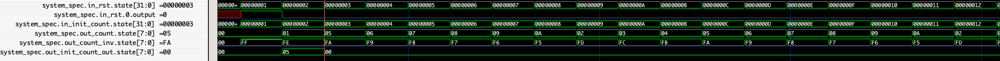

# Synchronous Circuits

This app provides an isomorphic mapping of synchronous digital logic to aegir
waves[1], and is intended to demonstrate the equivalence of bittide execution
semantics to synchronous circuits. There exist other mappings that depend on how
the circuit is partitioned. This is the simplest mapping for the purpose of
illustration.

The user of the application can write a Verilog design in `design.v`, which they
can synthesize with [Yosys](https://yosyshq.net/yosys/) and convert the ensuing
netlist to aegir waves via `aig2waves.py`.

[1] Note: "waves" is the name of the domain specific language in aegir to
express applications and shouldn't be confused with a wave/waveform, i.e., signal
traces visualized by value change dumps.

## Example Usage

The example design in `design.v` is reproduced here for discussion,

```verilog
module counter #(parameter W = 8) (
    input clk, rst,
    input [W - 1:0] init_count,
    output reg [W - 1:0] count,
    output reg [W - 1:0] count_inv,
    output reg [W - 1:0] init_count_out);

    reg [W - 1:0] next_count;
    always @(posedge clk)
        if (rst)
            count <= init_count
        else
            count <= next_count;

    always @(*) begin
        if (count >= 10)
            next_count = count - 8;
        else
            next_count = count + 1;
        count_inv = ~count;
        init_count_out = init_count;
    end

endmodule // counter
```

The design has 2 inputs

* `rst`: a synchronous reset
* `init_count`: the initial count value when reset is asserted

and 3 outputs

* `count`: the counter value; models direct register otputs
* `count_inv`: the inverted counter value; models register outputs followed by combinational logic
* `init_count_out`: the initial count value to be used for reset; models combinational outputs

Input `clk` is made implicit in the aegir waves mapping.

Each input in the Verilog module will be mapped to an action prefixed by `in_`,
e.g., `init_count` will have an equivalent action `in_init_count`.

Likewise each output will be mapped to an action prefixed by `out_`, e.g,
`count` will have an equivalent action `out_count`.

These signal names are useful for later viewing the value change dump (VCD)
emitted by aegir to observe the circuit's behavior.

## Invocation

1. Populate `design.v` with a synchronous Verilog design.

2. Run `yosys` on the design to generate target netlist, emitted to file `design_aig.json`.

    ```shell
    yosys design.ys
    ```

3. Populate `design_stimulus.json` with stimulus for your design. The file is a
   simple JSON format; for each input there's a list of values to be used in
   driving your design under simulation.

    ```json
    {
        "rst": [1, 0, 0, 0, 0, 0, 0, 0, 0, 0, 0, 0, 0, 0, 0, 0, 0, 0, 0, 0],
        "init_count": [5, 0, 0, 0, 0, 0, 0, 0, 0, 0, 0, 0, 0, 0, 0, 0, 0, 0, 0, 0]
    }
    ```
    The stimulus resets the circuit such that in the initial cycle the counter
    has the value 5. The design is subsequently left to run for some number of
    steps.

3. Run `aig2waves.py` to emit the design as a waves application

    ```shell
    python aig2waves.py design_aig.json design_stimulus.json design.rs
    ```

4. Finally run the application,

    ```shell
    cargo run --package circuit
    ```

5. Optionally view the generated VCD by the execution of the aegir waves
   application. Below is a waveform generated by
   [GTKWave](http://gtkwave.sourceforge.net/) for this particular design and
   stimulus.

   

   While the outputs are clearly visible from the waveform, the inputs require
   referencing back to the source as the design is bit blasted. (The input
   `state` is an index into the stimulus vector.) The waveform shows the initial
   count value (`init_count = 5`) after the design comes out of reset. The
   counter is subsequently incremented until it hits 10. It then steps back to
   2 and starts counting up once more as described by our logic in the
   Verilog design.

   ```verilog
    if (count >= 10)
        next_count = count - 8;
    else
        next_count = count + 1;
   ```


