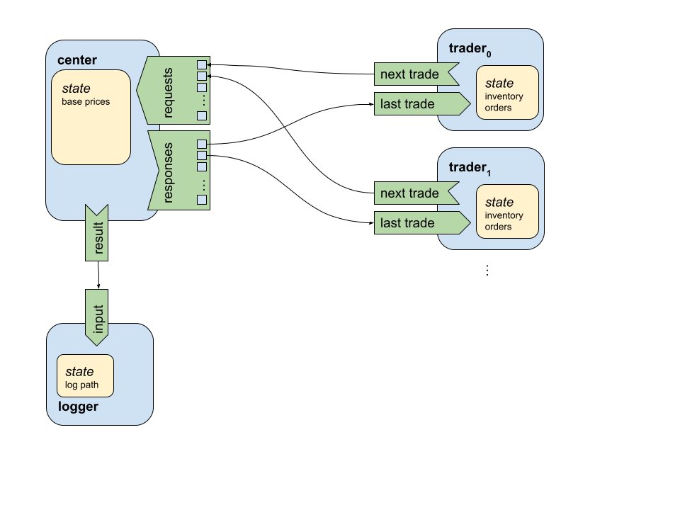
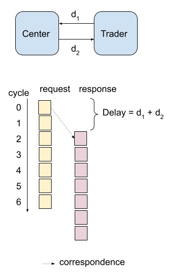

# Financial Exchange Application Overview

Exchange is an implementation of a trading platform for goods or financial instruments.

## Goals

Demonstrate the value of bittide as a platform for microservices by implementing a financial trading exchange. The advantages of bittide are:

* level playing field:
    * all participants submitting orders in a given quanta will have their orders processed
      together, with matching precedence a matter of policy and not mechanism
    * policies can include various definitions of fairness, differentiated levels of service,
          etc
    * all participants see all of the transactions processed during a given quanta at the same time
      (some future quanta)

* guaranteed SLAs: number of matches per metacycle (quanta), number of served requests and
  transactions.

* minimize the time quanta for issuing requests and computing transactions
    * orthogonally, show that having deterministic discrete quanta (which existing systems cannot
      implement) enables new features, like atomic multi-step matching

* show the simplicity all the way down to hardware

We assume the reader is familiar with bittide and do not intend to explain its architecture or the
programming model here. Please see [https://github.com/bittide](https://github.com/bittide).

## Application

We aim to build the simplest minimally complete system first, and then incrementally add features.
Here are some proposals (not necessarily a linear sequence) for what such an incremental evolution
could look like.

**Minimal Sufficient Functionality**

*   single process for the exchange
    *   matching and accounting (and clearing) happens here purely in-memory
*   one process/action per participant
    *   participants are wired to the exchange with equal delay

The application is organized as a connection nodes, each having inputs, outputs, and possible
state. Here's an overview of the financial exchange expressed as a bittide application.

By nature of how bittide works, the number of traders and asset-classes are fixed (known
compile-time constants). All messages sent between nodes must be serializable, including trade
requests and responses as described further below. (Nodes exchange full messages even in the
absence of meaningful information.)

The application topology is fixed and known a priori and all communication between nodes in the
application are messages that must be serializable (i.e., have predetermined size in bits at
compile-time).

The three kinds of nodes in the application (and their cardinality [n]) are,

**Center** [1]:   This is the exchange, where traders sell their assets and buy others.

The center has a request input and a response output for each trader. These I/Os are handled by
  arrays, where index `i` of the array are used for trader `i`.

**Trader** [`TRADER_COUNT`]:   An entity with inventory and orders to be placed.

* The number of traders in the exchange is compile-time constant `TRADER_COUNT`.

Traders keep track of their inventory and orders.

Inventory: a tally of each asset type the trader owns, e.g.,

    Asset Class | Count
    ------------|------
    USD         |  10
    NZD         |  3
    ...         |  ...
    YEN         |  29

Note: the number of asset classes is a compile time constant (6 at the time of writing) where each
asset is differentiated by an id (0...5). The use of dollars here is just illustrative.

Order Book: Contains spreads of bids and asks for the trader characterizing trades for a single
asset class. For example, here's a hypothetical order-book for USD.

    Entry   |     Bids [1]      |  Asks [2]
    --------|-------------------|--------------------
    0       |      10           |   0
    1       |      0            |   6
    ...     |      ...          |  ...
    29 [3]  |      0            |  100

Order books serve two purposes: they're sent as requests to the center and also received as
responses:

1. As a response from the center: the number of units bought. As a request to the center: buy
orders to be fulfilled.

2. As a response to the center: the number of units sold. As a request to the center: sell orders
to be fulfilled.

3. Bids and asks are actually represented by struct `QuantitySpread`. The struct has a `spread`
member which is an array of size `BOOK_DEPTH`.

Each book entry is the price at which the asset is traded, i.e., the spread is a table of discrete
price points and the count of each entity for the given price-point.

**Logger** [1]:   Logs the transactions in the exchange; for testing purposes.

Common terms used between traders and the center,

**Asset Classes**: The types of things that traders what to exchange in the market. The number of
asset classes is compile-time constant `ASSET_COUNT`.

**Spread**: The dollar values and associated quantities at which assets are traded (bought/sold as
recorded by bids and asks in the order-book).

### Application Node Responsibilities

#### Application-wide Assumptions

In each iteration traders start out with some inventory. They then randomly chose a "target
quantity", i.e., the number of units they want their inventory to be, and based on this target they
place bid and ask orders. Since their targets are random and constantly changing the traders will
continue to populate order-books with non-zero bids/asks ad infinitum.

#### Trader

In each iteration, a trader

1. Has an inventory from which it can sell assets (which bound the asks in their order-book)

1. The mix of assets they want to buy (the bid quantities and associated price-points in their
order-book)

1. The mix of assets they want to sell

Traders populate their `TradeRequest` order-books with this information and submit trade requests
to the center. Orders aren't fulfilled immediately. The trader's request has the following lifetime:

* reaches the center in the number of hops defined by the connection of the trader to the center (this is an architecture specific parameter that currently "leaks" into the application);

* the order is then filled at the center based on a trading algorithm (for a single exchange, that is one cycle; for a sharded exchange it may be multiple cycles);

* the center's response is received after the number of hops it takes to reach the trader

A trade request is not a guaranteed to be fulfilled to its entirety. That is, the number of assets
actually bought/sold may differ from the requested quantities.

A trader must therefore update their inventory upon the receipt of a trade response.

In order for a trader to merge the response of the center into its inventory. It needs to to know
the original corresponding trade request that was submitted. Each trader therefore has a look-back
window of its previous trades (as part of its state) referred to as the trader's "outstanding
orders". The size of this look-back window must be equal to the delay (number of hops) in the
synchronous network.

When a trader places an ask request, it commits the quantity of assets from its inventory for that
request. That is, it assumes all those assets will be sold. Upon receipt of the response the trader
will refund itself the unsold assets and adjust its inventory.

#### Center

The center is where requests from all traders are brought together to fulfil orders. The current
implementation of the center implements a "fair trading" algorithm where it tries to distribute the
supply of assets evenly to all traders with bids for that given asset. Fundamentally this is just
an allocation of asks to bids.

Once all the requests have been fulfilled. The center sends a response to each corresponding trader
informing them what they *actually* bought and sold as an order-book. (Recall that each trader's
request is simply the *desire* to buy and sell.)

## Invocation Nuances

The exchange app can can be invoked in two various ways

* `exchange::run_exchange_app`: a functional evaluation of the application spec where nodes are
  evaluated in round-robin fashion for the desired number of cycles.

* `exchange::simulate_exchange_app`: simulation of the application spec differentiated by the
  additional steps of 1. resource allocation 2. scheduling 3. setting up calendars for
  communication links. (This approach is currently only used in tests, to compare functional and
  simulated runs for validation purposes.)

## Potential extensions

### Sharded Exchange

Purpose: validate ease of decomposition

*   multiple processes for the exchange

    *   each process responsible for a subset of traded goods/instruments
        * This is a good first step. But it still has a linear runtime with the number of traders
          in the system. In the iso-efficiency sense, scalability hasn’t improved (just the
          constants).

   * split on both dimensions. Each node inputs N traders, trades between them, aggregates the
     unfilled orders, and acts like a trader itself. This permits an N-ary tree-reduction. The
     runtime scales with log base N of the number of traders.

*   matching and accounting still happen purely in-memory

*   connectivity
    *   processes are wired fully-connected to each other
    *   participants are wired to a subset (number == desired redundancy)

*   exchange processes need to forward orders to one another
    *   i.e., participants are not directly connected to the relevant exchange
    *   multi-step matches potentially require a tour through multiple processes
    *   this impacts the maximum quanta frequency

### Redundant Persistent Datastore

Purpose: validate ease of composition

*   compose the exchanges with a distributed consistent datastore service
    *   records accounting data (transaction log, participant portfolios, etc)
    *   wired only to exchanges, not participants
        *   participants still get all of their data from the exchange

Datastore service:  _R_ storage replica processes, and _W_ write controller processes

* reads can be against any replica, they all contain all of the data

* writes can be against any controller, they propagate to all replicas
    * each controller is output-wired to all replicas; all controller-replica connections are
      equal-delay

* replica connectivity:
    * read ports (number of these depends on desired bandwidth; each port need not be valid on
      every metacycle which allows limited bandwidth to be spread across multiple clients):
      fixed-size address (input) and data (output) pairs; the data output reflects the data at the
      address from a fixed-delay prior metacycle

    * write ports, wired only to controller processes (one port per controller): port contains
      fixed size address-plus-data frame (input)

* controller connectivity:
    * input ports: each port has for write address-data frame; number of ports depends on desired
      bandwidth, need not be always available, just like replica read ports

    * output ports: each port for one write address-data frame; one port for each replica

Composition:

* each exchange wired for datastore read against some subset of replicas (number == desired
  redundancy; parameterized)

* each exchange wired for datastore write against some subset of controllers (again, parameterized
  redundancy)

System specification -- we specify the topology of the system with a few parameters, which in turn
would tell us what the virtual provision would need to look like (for simulation, etc):

*   number of participant processes
*   number of exchange processes
*   max exchange transactions per quanta
*   for each participant, max bid-ask updates per quanta
*   number of storage replicas
*   number of storage controllers
*   number of replicas read-connected per exchange
*   number of controllers write-connected per exchange

See also the key-value store [doc](../../docs/kvstore.pdf) and [code](../kvstore).

## Reference Algorithms

### Algorithms for matching

*
  [Overview](https://corporatefinanceinstitute.com/resources/knowledge/trading-investing/matching-orders/)

* [List of
  algorithms](http://web.archive.org/web/20120626161034/http://www.cmegroup.com/confluence/display/EPICSANDBOX/Match+Algorithms)

- Most commonly used algorithms: Price/Time (FIFO) and Pro-Rata

    - time in the bittide case would be meaningful only if orders can not be fulfilled in a time
      quanta and are left for later. So it seems that Pro-Rata would be more appropriate.

